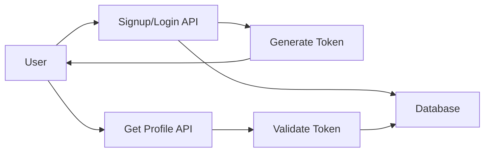

# *User Managemnt API*

A RESTful API for managing user accounts,including signup,login and profile retreival.

## Table of contents
 - [Base URL](#base-url)
 - [Authentication](#authentication)
 - [User Signup](#user-signup)
 - [User Login](#user-login)
 - [Get User Profile](#get-user-profile)
 - [Error Codes](#error-codes)
 - [Example Request](#example-request)
---
## System Architecture


## Base URL
http://localhost:8080/API
---
## Authentication

This API uses **Bearer Token Authentication**.
Include the token in the request headers:
Authorization Bearer <your token>
---  
## User Signup
### Endpoint
'POST/User/signup'
### Description
### Creates a user account
### Request Body
--json
{ name:"Vrushali Sharma",
  email:"vrushaliabhale@example.com",
  password:"vrush123"
}
 Response(201 created)
--json
{
"message" :"User created Successfully",
"userId":"1234"
}
Error Response(400 Bad Request)
{
"error" :"Email already exits"
}
--json

 ## User Login
 Endpoint
POST/Users/login
 Description
Authenticate the user and provides JWT Token
### Request Body
--json
{
"email":"vrushaliabhale@example.com",
"password":"vrush123"
}
--json
Response(200 OK)
{
"token"=<your token>
}
## Get User Profile
'GET/users/profile'
### Fetches the profile of authenticated user.
Headers
### Authorization: Bearer <your token>
### Response(200 OK)
--json
 {
 "userid":"1234",
 "name":"Vrushali",
 "email":"vrushaliabhale@example.com"
 }
## Error Codes
  |Status Code|Description |
  |----------------------- |
  |200        |Success     |
  |201        |Created     |
  |400        |Bad Request |
  |401        |Unauthorized|
  |500        |Server Error|

 ## Example Request

```bash
curl -X POST http://localhost:8080/api/users/signup \
-H "Content-Type: application/json" \
-d '{"name":"Vrushali","email":"vrushaliabhale@example.com","password":"vrush123"}'


