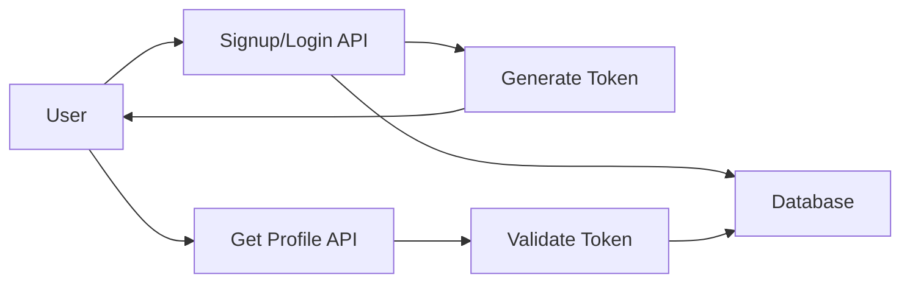

# User Management API*


A RESTful API for managing user accounts, including signup, login, and profile retrieval.

---

## API Version
Current Version: v1

## Table of contents
 - [Overview](#overview)
 - [Prerequisites](#prerequisites)
 - [System Architecture](#system-architecture)
 - [Base URL](#base-url)
 - [Authentication](#authentication)
 - [User Signup](#user-signup)
 - [User Login](#user-login)
 - [Get User Profile](#get-user-profile)
 - [Error Codes](#error-codes)
 - [Example Request](#example-request)
---
##  Overview

This API allows users to:
- Create an account (Signup)
- Authenticate and receive a token (Login)
- Access protected user data (Profile)

It demonstrates RESTful API design with token-based authentication.

---

## Prerequisites

- Java 8+
- Postman or any API testing tool
## System Architecture



##Preriquisites

-Java 8

-Any testing tools


## Base URL
http://localhost:8080/API
---
## Authentication

This API uses **Bearer Token Authentication**.
Include the token in the request headers:
Authorization Bearer <your token>
---  
## User Signup
### Endpoint
'POST/User/signup'
### Description
### Creates a user account
### Request fields

|Field   | Type |Required|  Description    |
|--------|------|--------|-----------------|
|name    |string| Yes    |Full name of user|
|email   |string| Yes    |Email of user    |
|password|string| Yes    |Account password |

### Request Body

--json
{name:"Vrushali Sharma",
 email:"vrushaliabhale@example.com",
 password:"vrush123"
}
---
### Response Fields
|Field  | Type |Description           |
|-------|------|----------------------|
|message|string|Success message       |
|userId |string|Unique user identifier|

Response(201 created)
--json
{
"message" :"User created Successfully",
"userId":"1234"
}
---
Error Response(400 Bad Request)
{
"error" :"Email already exits"
}
--json

 ## User Login
 Endpoint
POST/Users/login

Description
Authenticate the user and provides JWT Token

### Request Body

{
"email":"vrushaliabhale@example.com",
"password":"vrush123"
}

Response(200 OK)
{
"token"=<your token>
}
## Get User Profile
'GET/users/profile'
### Fetches the profile of authenticated user.
Headers
### Authorization: Bearer <your token>
### Response(200 OK)

 {
 "userid":"1234",
 "name":"Vrushali",
 "email":"vrushaliabhale@example.com"
 }
 
## Error Codes
  |Status Code|Description |
  |-----------|----------- |
  |200        |Success     |
  |201        |Created     |
  |400        |Bad Request |
  |401        |Unauthorized|
  |500        |Server Error|

### Status Code details
-**200 OK** -> Request Successful
-**201 Created** -> Resource Created Successfully
-**400 Unauthorized** -> Missing or invalid token
-**500 Server Error** -> Internal server issue
## How to use
1. Register a new user using the Signup API.
2. Login to receive authentication token.
3. Use the token in authentication header.
4. Access protected endpoints like Get Profile.
Example header:
```
Authorization: Bearer <your_token>
```

## Example Request

```bash
curl -X POST http://localhost:8080/api/users/signup \
-H "Content-Type: application/json" \
-d '{"name":"Vrushali","email":"vrushaliabhale@example.com","password":"vrush123"}'

---
Notes
-All responses are in json format
-Ensure validation on client side
-Token should stored securely
--- 


